<div align="center">


# SyncChat

**A high-performance, real-time 1:1 chat application built with Django 6 and Channels.**

[](https://www.python.org/)
[](https://docs.djangoproject.com/en/6.0/)
[](https://channels.readthedocs.io/)
[](https://www.postgresql.org/)
[](#testing)
[](https://docs.astral.sh/ruff/)
[](#license)

</div>

---

## About

SyncChat is a production-grade, real-time messaging platform that delivers instant 1:1 communication over native WebSockets — no polling, no third-party realtime SaaS. It pairs an asynchronous **Django 6 + Channels** backend served through **Daphne (ASGI)** with a zero-build **vanilla JavaScript** frontend, backed by **PostgreSQL**. Beyond standard messaging, SyncChat implements a privacy-first architecture: a live presence system with heartbeat-based liveness detection, read receipts and typing indicators you can opt out of, and a *silent blocking* model where blocked users receive no signal that anything changed — their view is quietly frozen while the blocker's experience remains untouched.

## Key Features

### Real-Time Communication
- **Native WebSocket messaging** — bidirectional, low-latency delivery over two purpose-built Channels consumers.
- **Application-wide presence system** — online/offline status driven by heartbeats, tab-visibility awareness, a reconnect grace period, and a watchdog that force-closes dead connections.
- **Typing indicators & read receipts** — broadcast within conversation groups, both honoring individual privacy preferences.
- **Live unread badges & desktop notifications** — new-message events fan out through a global notification group so clients update even when a different chat is open.

### Security & Privacy
- **Silent symmetric blocking** — a block in either direction freezes the conversation; messages from a blocked sender are stored but never delivered, with no bounce, error, or unread increment.
- **Privacy anonymization** — blocked users see anonymized profiles (`null` ID, empty username); presence and last-seen are masked for anyone who disables online status.
- **Granular privacy controls** — toggle read receipts, hide online/last-seen status, and restrict profile visibility (Everyone / Contacts / Nobody).
- **Defense-in-depth** — CSRF protection, output-escaped rendering against XSS, WebSocket Origin validation, rate limiting on sensitive endpoints, POST-only logout, and cache-bypass middleware on authenticated pages.

### User Experience
- **Optimistic UI** — outgoing messages render instantly and roll back gracefully if the server rejects them.
- **Persistent theme system** — Light / Dark / System preference stored server-side, resolved before first paint with zero flash-of-wrong-theme.
- **Conversation management** — mute notifications, soft-delete chats (a new message restores them for everyone), and race-safe 1:1 conversation deduplication.
- **Paginated history** — the latest 50 messages load instantly; older history streams in on scroll via a cursor-paginated API.
- **Autosaving settings** — profile fields persist via debounced autosave endpoints.

### Media
- **Image sharing** — inline photos in messages and profile avatars, validated server-side by size, MIME type, decoded format, and dimensions (JPEG / PNG / WEBP / GIF).

## UI Showcase

<table>
<tr><td width="50%" valign="top">

### Authentication & Onboarding

| Screenshot | Description |
|---|---|
| 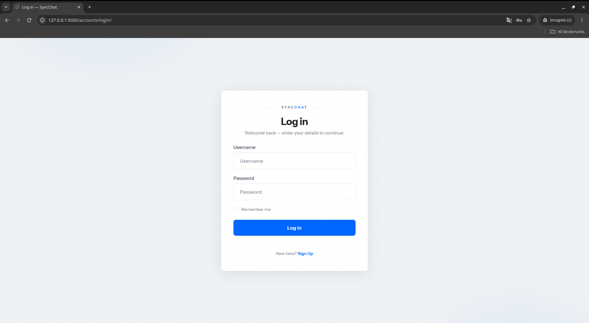 | **Login** — The session-authenticated sign-in screen, throttled at 5 attempts/min per IP. |
| 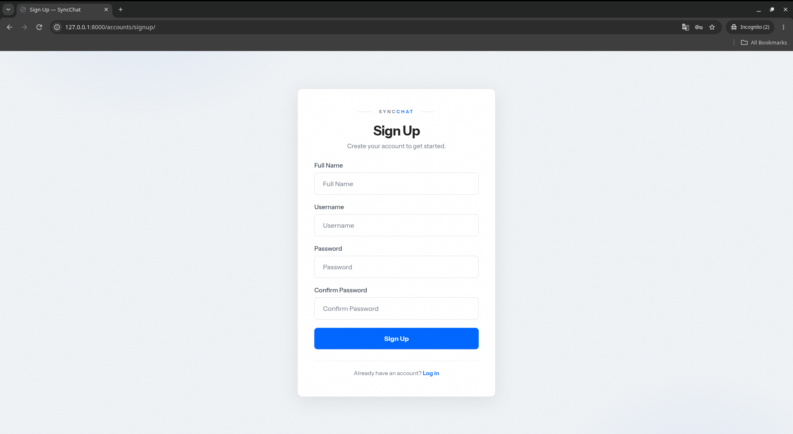 | **Registration** — Account creation form enforcing Django's full password-validation stack. |

### Core Chat Experience

| Screenshot | Description |
|---|---|
| 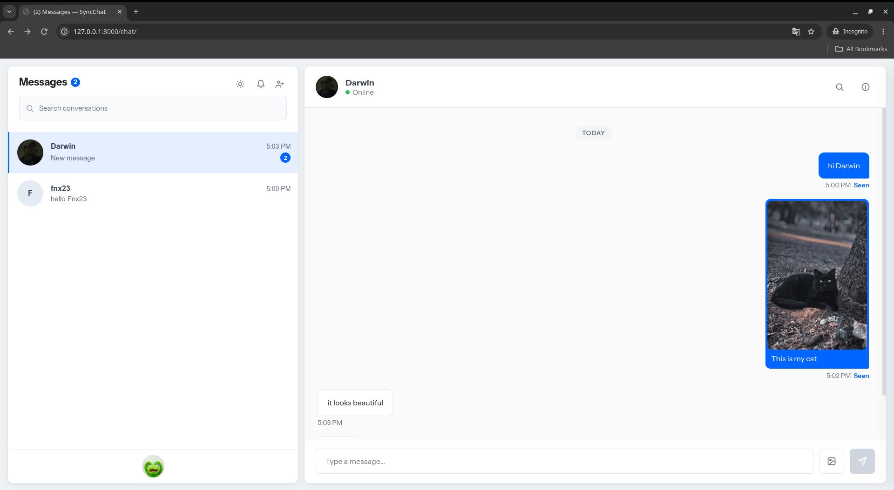 | **Dashboard** — The main `/chat/` workspace combining the conversations sidebar, live message thread, and real-time presence indicators. |
| 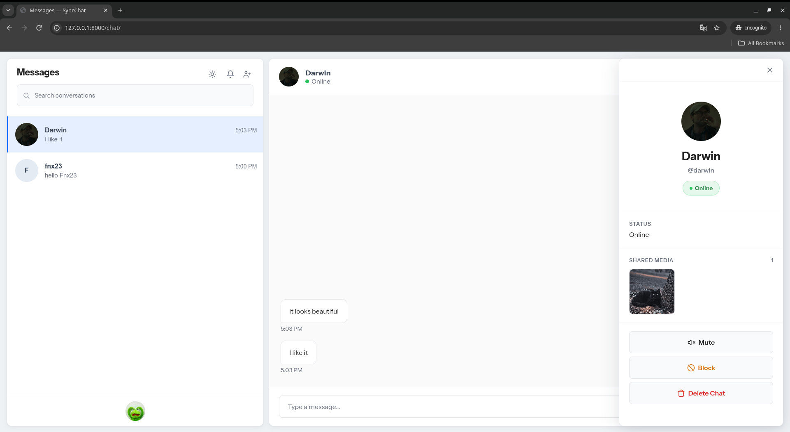 | **Chat Menu** — Per-conversation actions in the thread header (block, mute, delete) available in one click. |
| 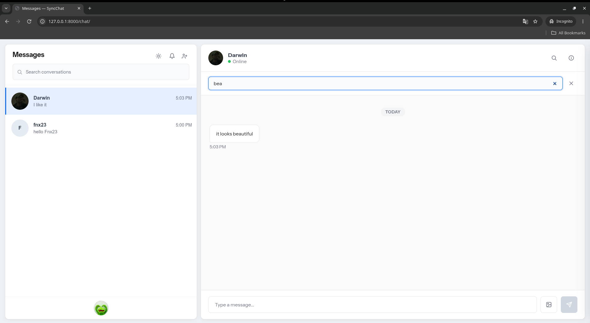 | **Conversation Search** — Instant client-side filtering of the sidebar conversation list. |
| 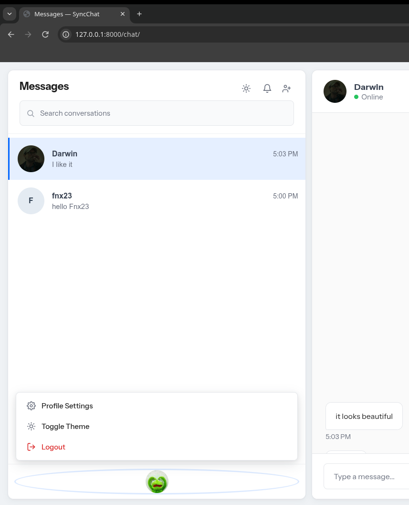 | **User Menu** — The avatar-triggered dropdown exposing profile settings, theme toggle, and logout. |

</td><td width="50%" valign="top">

### Starting Conversations & Settings

| Screenshot | Description |
|---|---|
| 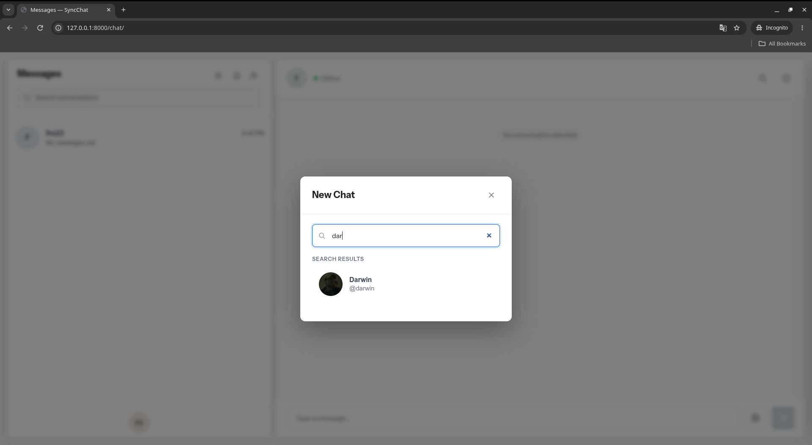 | **New Conversation** — The user-search modal with recent and suggested contacts, opening or reusing a deduplicated 1:1 chat. |
| 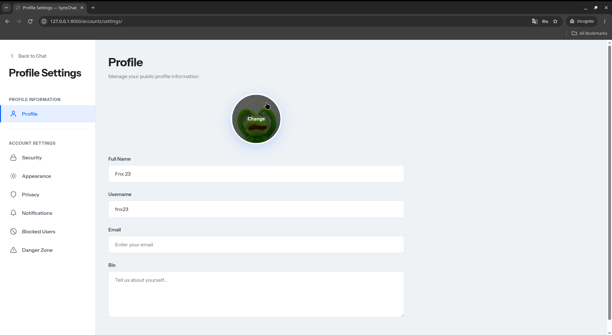 | **Profile Settings** — Display name, username, email, bio, and avatar management with autosave. |
| 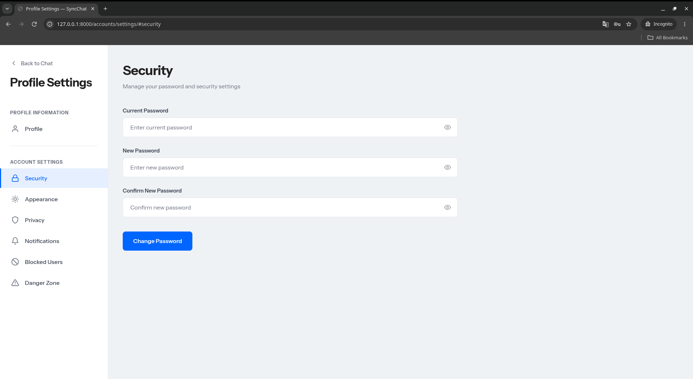 | **Security Settings** — Password change flow protected by re-authentication checks. |
| 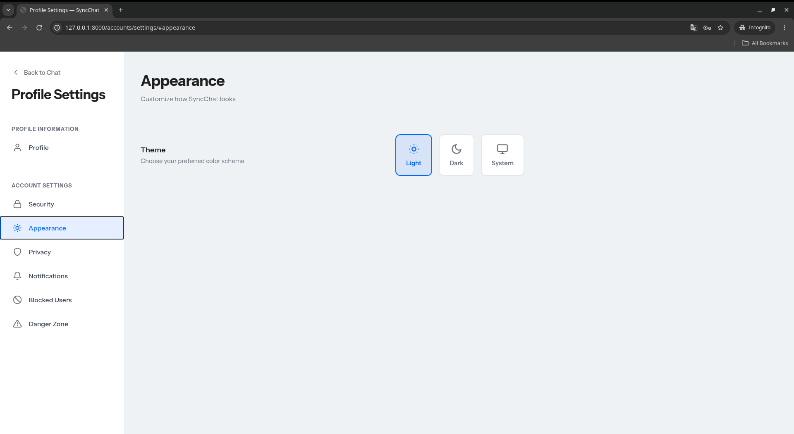 | **Appearance Settings** — Server-persisted Light / Dark / System theme selection applied without a flash on reload. |
| 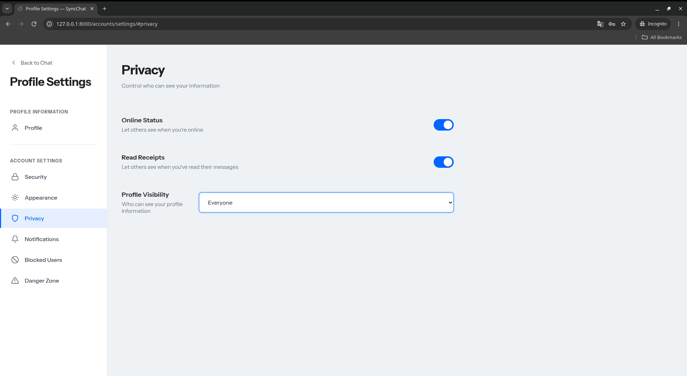 | **Privacy Settings** — Controls for online-status visibility, read receipts, and profile visibility scope. |
| 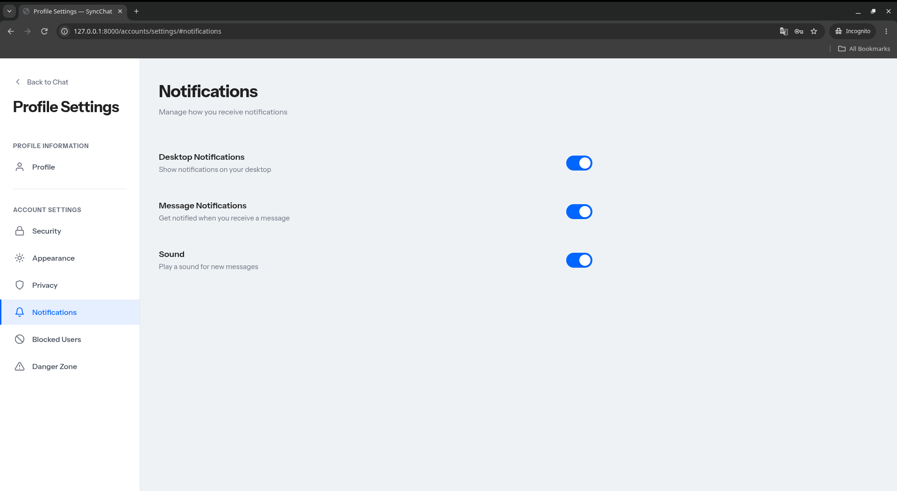 | **Notification Settings** — Preferences governing desktop alerts and unread behavior. |

</td></tr>
<tr><td colspan="2">

### Blocking & Privacy Flows

| Screenshot | Description |
|---|---|
| 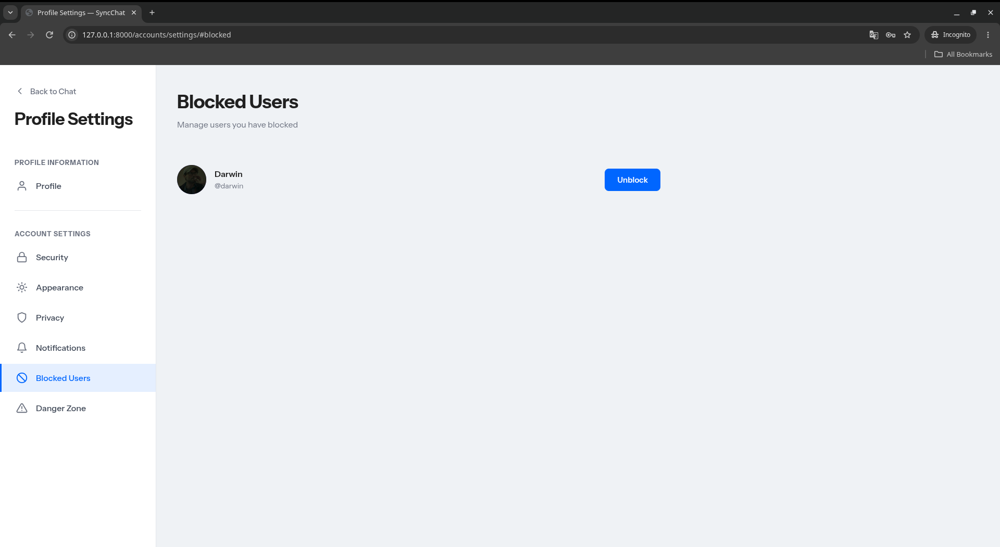 | **Block List** — Central management view of all blocked accounts with unblocking support. |
| 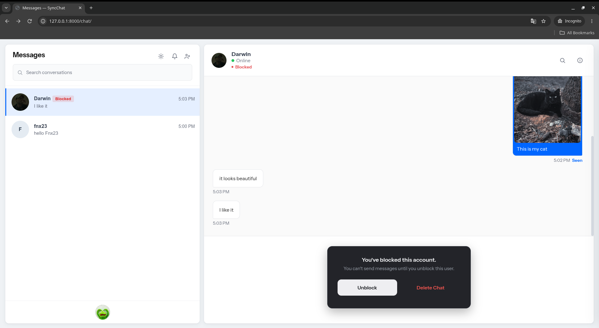 | **Block Confirmation** — The explicit modal shown before a block takes effect on both directions. |
| 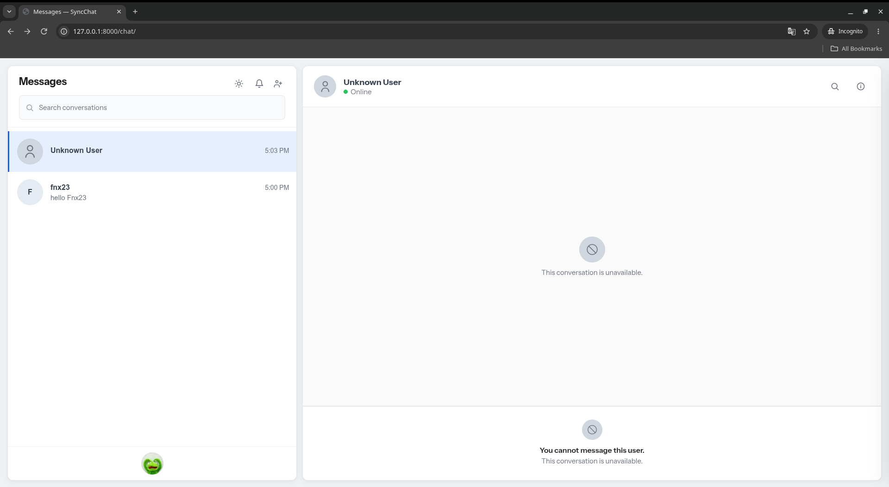 | **Blocked Experience** — What a blocked sender sees: a silently frozen conversation with no indication of the block. |
| 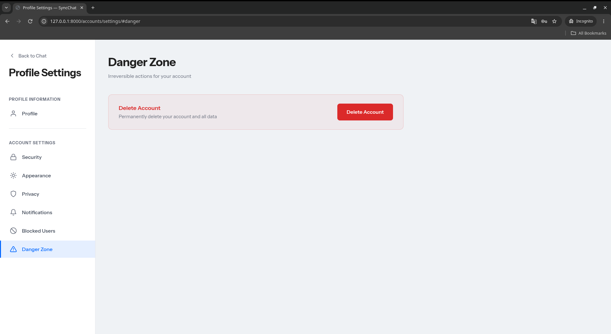 | **Account Deletion** — Destructive-action confirmation requiring password re-authentication. |

</td></tr>
</table>

## Tech Stack

| Category | Technology | Role |
|---|---|---|
| **Backend** | Django 6.0, Python 3.14+ | Application logic, ORM, session auth, templating |
| **Real-Time** | Channels 4.x, Daphne 4.x (ASGI) | WebSocket protocol handling and async consumers |
| **Database** | PostgreSQL (psycopg 3) | The only supported datastore — relational integrity, indexed queries |
| **Frontend** | Vanilla JavaScript, CSS, HTML | Zero-build SPA-style dashboard rendered through Django templates |
| **Media** | Pillow | Server-side image validation and processing |
| **Tooling / DevOps** | django-ratelimit, python-dotenv, Ruff, pre-commit | Throttling, env config, lint/format automation |

## Architecture & Design

### ASGI Topology

A single ASGI application routes each protocol to its handler. Every WebSocket handshake passes through two middleware layers before reaching a consumer:

```
                         ┌─────────────────────────────────────────────┐
   HTTP        ────────► │  Django ASGI application (views, admin)     │
                         └─────────────────────────────────────────────┘
                         ┌─────────────────────────────────────────────┐
   WebSocket   ────────► │  AllowedHostsOriginValidator                │  ← blocks cross-site hijacking
                         ├─────────────────────────────────────────────┤
                         │  AuthMiddlewareStack                        │  ← binds session user to scope
                         ├─────────────────────────────────────────────┤
                         │  URLRouter                                  │
                         │    /ws/presence/      → PresenceConsumer    │
                         │    /ws/chat/<int:id>/ → ChatConsumer        │
                         └─────────────────────────────────────────────┘
```

### WebSocket Strategy

SyncChat deliberately separates its two real-time concerns into independent sockets:

- **Global socket — `/ws/presence/`.** Opened once per authenticated browser tab on *every* page (not just `/chat`), so navigating between pages never flips a user offline. It owns app-wide state: presence announcements, profile updates (name/avatar changes pushed to all clients), and new-message notifications for unread badges and desktop alerts. Liveness is enforced by a client heartbeat, a per-connection watchdog (60 s visible / 300 s backgrounded tabs), a 45 s reconnect grace period, and forced offline on explicit logout.
- **Per-conversation socket — `/ws/chat/<id>/`.** One socket per open thread. Connection requires authenticated session membership as a conversation participant — non-participants are rejected at handshake. It carries messages, typing indicators, read receipts, and block-state changes scoped to that thread.

### Channel Groups & Broadcast Strategy

| Group | Membership | Broadcasts |
|---|---|---|
| `presence` | Every authenticated connection | Online/offline transitions, profile updates, new-message notifications |
| `conversation_<id>` | Participants with the thread open | Messages, typing, read receipts, block/unblock re-sync events |

Frame construction is centralized in `chat/broadcast.py`, so the HTTP fallback path and the WebSocket path emit byte-identical events and can never drift apart. The channel layer runs on the in-memory backend for single-process deployments; setting `REDIS_URL` swaps in `channels-redis` for multi-worker production topologies.

## Security & Privacy

| Layer | Measure |
|---|---|
| **CSRF** | Django CSRF middleware on all state-changing requests; logout is a POST-only form, preventing forced logouts. |
| **XSS prevention** | All user-generated content is escaped at render time (`textContent`, HTML entity escaping) before DOM insertion. |
| **WebSocket origin validation** | `AllowedHostsOriginValidator` rejects handshakes whose `Origin` is not in `ALLOWED_HOSTS`, defeating cross-site WebSocket hijacking. |
| **Rate limiting** | Per-endpoint throttles via `django-ratelimit`: login (5/min/IP), signup (10/min/IP), message sending (30/min/user), conversation creation (20/min/user), searches and history reads (60/min/user). |
| **Transport & cookies** | HSTS (1 year, preload, subdomains), SSL redirect, and secure cookies automatically enabled outside debug mode. |
| **Session hygiene** | `NoCacheMiddleware` prevents browser back-button access to authenticated pages after logout. |
| **Silent Blocking model** | Blocking is symmetric in effect: any block freezes messaging in both directions. Messages sent into a block are persisted with a `blocked_delivery` flag — visible to the sender, never delivered to the receiver (no event, no unread count, hidden from history). Blocked users also receive *anonymized* payloads (`null` IDs, empty usernames) so they cannot track the blocker's identity, activity, or profile updates. |
| **Upload validation** | Images validated by size (5 MB messages / 2 MB avatars), MIME type, decoded format, and max dimensions (8000 px). |
| **Data model integrity** | Database-enforced constraints: unique pair keys prevent duplicate 1:1 chats under concurrent requests, self-blocking is impossible, and every message must carry content or an image. |

## Installation & Setup

### Prerequisites

| Requirement | Version |
|---|---|
| Python | 3.14+ |
| PostgreSQL | 16+ recommended |
| Redis *(optional)* | Required only for multi-process/production channel layer & rate-limit cache |

### Steps

**1. Clone the repository**

```bash
git clone https://github.com/<your-username>/SyncChat.git
cd SyncChat
```

**2. Create a virtual environment**

```bash
python -m venv .venv
source .venv/bin/activate        # Windows: .venv\Scripts\activate
pip install -r requirements.txt
```

**3. Create the PostgreSQL role and database**

```sql
CREATE USER syncchat_user WITH PASSWORD 'your-password';
CREATE DATABASE syncchat_db OWNER syncchat_user;
```

**4. Configure environment variables**

```bash
cp .env.example .env
```

Then edit `.env`:

```env
DJANGO_SECRET_KEY=<generate with: python -c "import secrets; print(secrets.token_hex(50))">
DJANGO_DEBUG=False
DJANGO_ALLOWED_HOSTS=127.0.0.1,localhost
DB_NAME=syncchat_db
DB_USER=syncchat_user
DB_PASSWORD=your-password
DB_HOST=localhost
DB_PORT=5432
# REDIS_URL=redis://127.0.0.1:6379/0   # optional — enables shared channel layer & rate limiting
```

> The server fails loudly if `DJANGO_SECRET_KEY` or `DB_PASSWORD` is unset — there are no insecure defaults.

**5. Apply migrations**

```bash
python manage.py migrate
```

## Running the Application

Development (ASGI-enabled `runserver`, backed by Daphne via `INSTALLED_APPS`):

```bash
python manage.py runserver
```

Production-style — serve the ASGI application directly with Daphne:

```bash
daphne -b 0.0.0.0 -p 8000 syncchat.asgi:application
```

Open **http://127.0.0.1:8000** — visitors land on login; authenticated users go straight to the dashboard at `/chat/`.

<details>
<summary><strong>Production checklist</strong></summary>

```bash
pip install channels-redis django-redis   # activate via REDIS_URL in .env
python manage.py collectstatic            # serves STATIC_ROOT (staticfiles/)
```
- Serve `staticfiles/` and `media/` from your web server or CDN — Django does not serve them in production.
- Set `DJANGO_DEBUG=False`, list real domains in `DJANGO_ALLOWED_HOSTS`, and terminate TLS upstream (`SECURE_PROXY_SSL_HEADER` is preconfigured).

</details>

## Testing

The project ships a **225-test suite** covering models, migrations, HTTP views, WebSocket consumers, privacy rules, blocking semantics, and security/rate limits:

```bash
python manage.py test --noinput
```

Tests are organized per app by concern — e.g. `chat/tests/test_consumers.py` (WebSocket protocol), `chat/tests/test_privacy.py` (silent blocking), `accounts/tests/test_delete_account.py` (data lifecycle).

## Roadmap

- [ ] End-to-end encryption for message payloads
- [ ] Group conversations beyond 1:1
- [ ] Message reactions and replies/quoting
- [ ] Shared Redis-backed presence store for horizontal scaling
- [ ] File attachments beyond images (documents, voice notes)
- [ ] Progressive Web App support with offline caching

## Contributing

Issues and pull requests are welcome. Please run the test suite and `ruff check . && ruff format --check .` before submitting.

## License

This project is licensed under the [MIT License](LICENSE).

---

<div align="center">
<sub>Built with Django 6, Channels, Daphne, PostgreSQL, and vanilla JavaScript.</sub>
<br/>
<sub><a href="#syncchat">Back to top ↑</a></sub>
</div>
